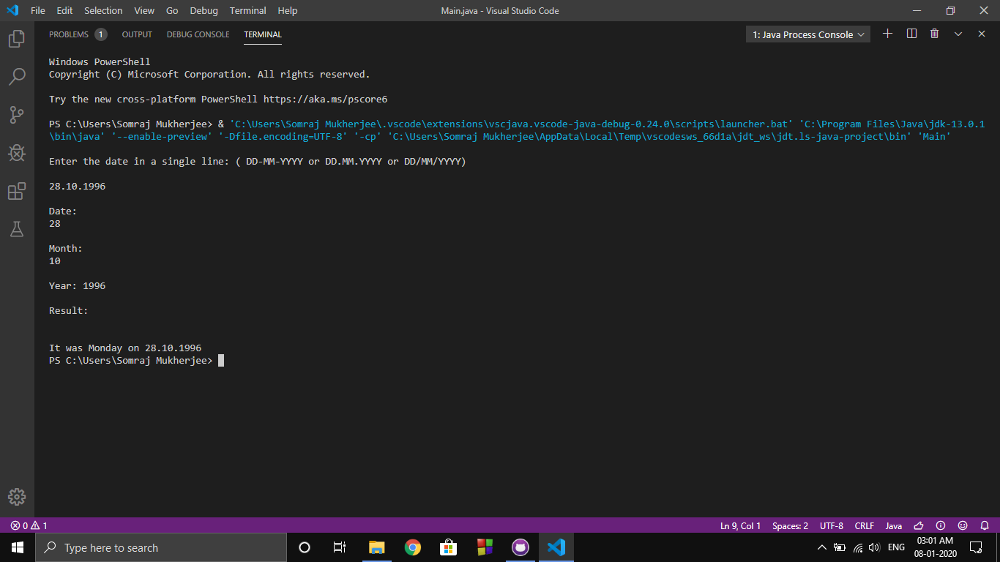

# Date to Day Conversion in C Java Python
Date to Day Conversion in C Java Python is used to get the specific day from a date. It can also be used to get the month. I have used Tomohiko Sakamoto’s Algorithm to determine the day.

## Run This Here

[RUN](https://Date-to-Day-Conversion-in-C-Java-Python.iamsomraj.repl.run)

## Image

## Note

Previously, I was using the Zeller's rule. But it was hard to get it right for different languages because of the arithmetic evaluation difference.

Now, I am shifted to Tomohiko Sakamoto’s Algorithm. It is best for programming and does not behave abnormally for different languages. 

Happy coding! 😊

## Objective

Date ( DD-MM-YYYY ) to Day ( Sunday, Monday, ... )

## Developer

LinkedIn : [iamsomraj](https://www.linkedin.com/in/iamsomraj/) 😊

HackerRank: [iamsomraj](https://www.hackerrank.com/iamsomraj?hr_r=1) 😊

## Show Your Support

Give me a star ⭐

if this project helped you 👦 👧

## Contributing

Pull requests are welcome. 🤝 For major changes, please open an issue first to discuss what you would like to change. 🙏

Please make sure to update tests as appropriate. ✌

## License

[MIT](https://choosealicense.com/licenses/mit/) 📰
